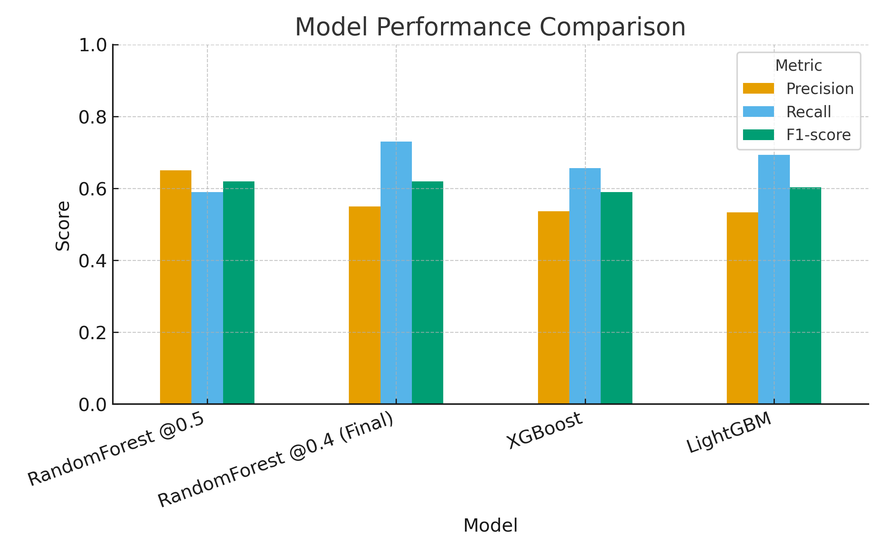
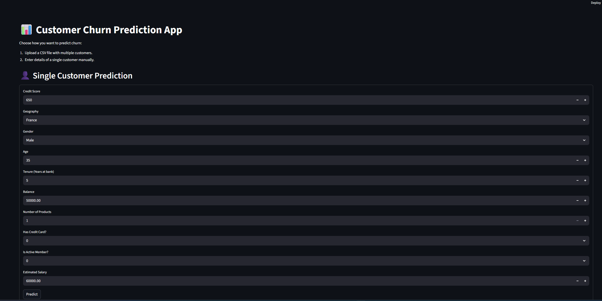
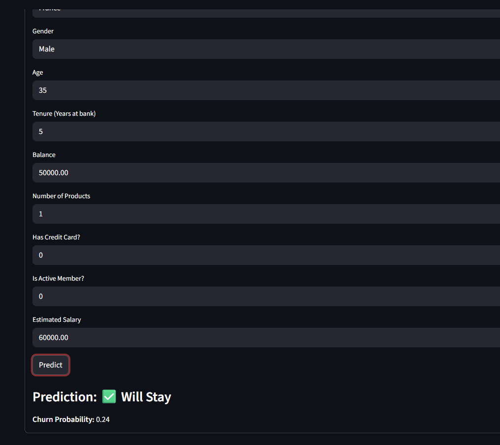
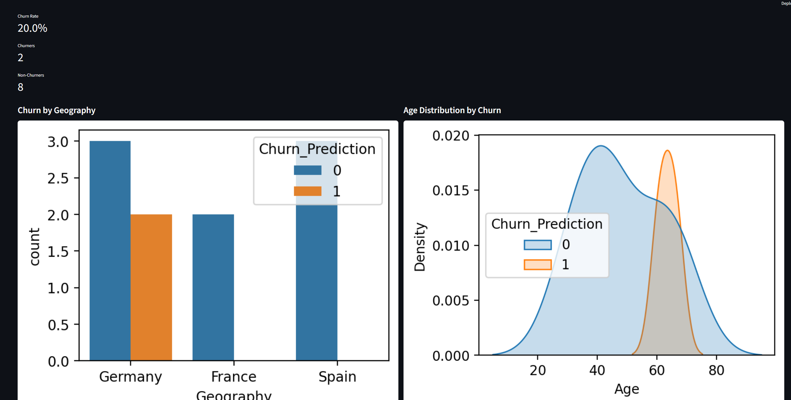
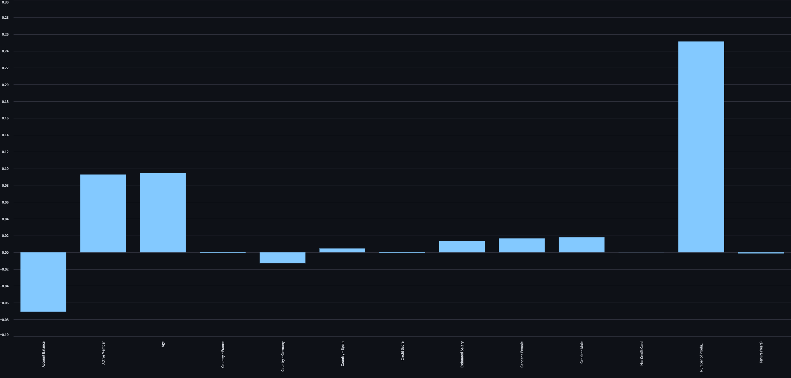

# 📊 Customer Churn Prediction App — Pro Edition

This project is a **Streamlit web app** that predicts whether customers are likely to **churn (leave)** or **stay** based on their data.  
It was built using **scikit-learn, LightGBM, XGBoost, and RandomForest**, with the best tuned model saved and deployed.

---

## 🚀 Features
- 👤 **Single Prediction** → form for one customer.  
- 📂 **Batch Prediction** → upload a CSV with customer data.  
- 📊 **Insights Dashboard** → compact graphs with **auto-generated insights**:  
  - Churn by Geography  
  - Churn by Age Distribution  
  - Churn by Gender  
  - Churn by Number of Products  
  - Churn by Tenure  
- 🔮 **Explainability with SHAP**:  
  - Friendly feature names  
  - Local explanations (waterfall plots)  
- 📖 **Narrative Generator** → auto executive summaries.  
- 📥 **Downloadable Reports**:  
  - CSV with predictions  
  - PDF with sharp charts + top 10 high-risk customers.  
- ⚙️ **Threshold Optimization** → cost-based tuning for better decisions.  
- 📈 **Executive KPIs** → estimate revenue at risk and churn impact.  
- ☁️ **Deployable via Streamlit Cloud** or **Docker**.  

---

## 🧠 Algorithms & Performance

Several machine learning algorithms were tested to predict churn. Below are the results:

| Model                        | Accuracy | Precision | Recall | F1-score |
|-------------------------------|----------|-----------|--------|----------|
| RandomForest (Tuned @ 0.5)    | **0.85** | 0.65      | 0.59   | 0.62 |
| RandomForest (Final @ 0.4)    | 0.82     | 0.55      | **0.73** | 0.62 |
| XGBoost                       | 0.8145   | 0.536     | 0.656  | 0.590 |
| LightGBM                      | 0.8140   | 0.533     | 0.693  | **0.603** |

### 📌 Explanation
- **RandomForest @ 0.5** → higher precision (65%) but missed many churners (recall = 59%).  
- **RandomForest @ 0.4 (Final)** → best trade-off with **Recall = 73%** and Precision = 55%, chosen as the deployed model.  
- **LightGBM** → had the highest F1-score but weaker at detecting churners.  
- **XGBoost** → more balanced, but weaker recall than RandomForest.  

✅ The deployed model in this app is **RandomForest with threshold = 0.4**, prioritizing recall to catch more churners.

---

## 📦 Installation

Clone this repository:
```bash
git clone https://github.com/Ahmedalaa1811/customer-churn-prediction.git
cd customer-churn-prediction
```

Install requirements:
```bash
pip install -r requirements.txt
```

---

## ▶️ Run Locally
```bash
streamlit run app.py
```

Then open in your browser:
```
http://localhost:8501
```

---

## ☁️ Deployment (Streamlit Cloud)

1. Push this repo to GitHub.  
2. Go to [Streamlit Cloud](https://share.streamlit.io).  
3. Click **New App** → select your GitHub repo.  
4. Set the **entrypoint** to `app.py`.  
5. Add a **Secrets section** if you need environment variables (not required here).  
6. Click **Deploy** 🚀.  

Your app will be live at:  
```
https://customer-churn-prediction-rhq6ymdj5t3xkeqnab2qnm.streamlit.app/
```

---

## 📊 Example Input
```csv
CreditScore,Geography,Gender,Age,Tenure,Balance,NumOfProducts,HasCrCard,IsActiveMember,EstimatedSalary
619,France,Female,42,2,0.00,1,1,1,101348.88
608,Spain,Female,41,1,83807.86,1,0,1,112542.58
```

## 📊 Example Output
```csv
CreditScore,Geography,Gender,Age,Tenure,Balance,NumOfProducts,HasCrCard,IsActiveMember,EstimatedSalary,Churn_Probability,Churn_Prediction
619,France,Female,42,2,0.00,1,1,1,101348.88,0.82,1
608,Spain,Female,41,1,83807.86,1,0,1,112542.58,0.12,0
```

---

## 📷 Screenshots
### Model Numbers  


### App Home  


### Single Customer Prediction  


### Batch Predictions & Insights  


### Dashboard with Insights  


### Explainability (SHAP)  



---

## 🧪 Test It Yourself
### Large Data
Use the included [sample_customers.csv](data/churn_test_large.csv) to try predictions instantly.
### Small Data
Use the included [sample_customers.csv](data/churn_test_customers.csv) to try predictions instantly.

---

## 👨‍💻 Author
Ahmed ALAA-ELSHEIKH
Built during **Data Science Diploma Project**.  
Contact: [LinkedIn](https://www.linkedin.com/in/ahmed-alaa-elsheikh-98a4b5182/) | [Email](mailto:ahmed.alaa181197@gmail.com)
