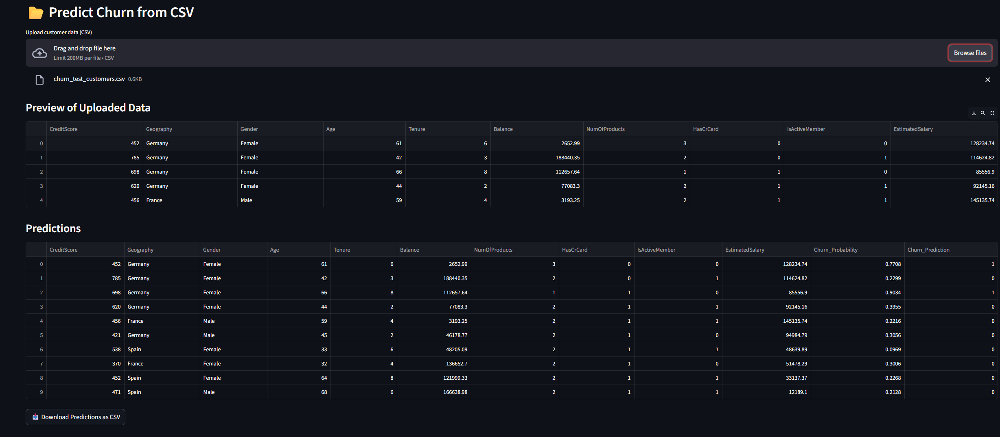

# Customer Churn Prediction App

This project is a **Streamlit web app** that predicts whether customers are likely to **churn (leave)** or **stay** based on their data.  
It was built using **scikit-learn, LightGBM, XGBoost, and RandomForest**, with the best tuned model saved and deployed.

---

## 🚀 Features
- Upload a CSV file with customer data.
- Predict churn probability and churn label (0 = stays, 1 = churn).
- Download results as a CSV file.
- Deployable via **Streamlit Cloud** or **Docker**.

---

## 📦 Installation

Clone this repository:
```bash
git clone https://github.com/Ahmedalaa1811/customer-churn-prediction.git
cd customer-churn-prediction
```

Install requirements:
```bash
pip install -r requirements.txt
```

---

## ▶️ Run Locally
```bash
streamlit run app.py
```

Then open in your browser:
```
http://localhost:8501
```

---

## ☁️ Deployment
### Option 1 — Streamlit Cloud
1. Push this repo to GitHub.
2. Go to [Streamlit Cloud](https://share.streamlit.io).
3. Select your repo and deploy `app.py`.

### Option 2 — Docker
```bash
docker build -t churn-prediction .
docker run -p 8501:8501 churn-prediction
```
Open [http://localhost:8501](http://localhost:8501).

---

## 📊 Example Input
```csv
CreditScore,Geography,Gender,Age,Tenure,Balance,NumOfProducts,HasCrCard,IsActiveMember,EstimatedSalary
619,France,Female,42,2,0.00,1,1,1,101348.88
608,Spain,Female,41,1,83807.86,1,0,1,112542.58
```

## 📊 Example Output
```csv
CreditScore,Geography,Gender,Age,Tenure,Balance,NumOfProducts,HasCrCard,IsActiveMember,EstimatedSalary,Churn_Probability,Churn_Prediction
619,France,Female,42,2,0.00,1,1,1,101348.88,0.82,1
608,Spain,Female,41,1,83807.86,1,0,1,112542.58,0.12,0
```

---

## 📷 Screenshots

### App Home


### Single Customer Prediction


### Single Customer Prediction


### Dataset Insights


---

## 🧪 Test It Yourself
Use the included [sample_customers.csv](sample_customers.csv) to try predictions instantly.
## 👨‍💻 Author
Built during Data Science Diploma Project.  
Contact: [LinkedIn](https://www.linkedin.com/in/ahmed-alaa-elsheikh-98a4b5182/) | [Email](ahmed.alaa181197@gmail.com)
